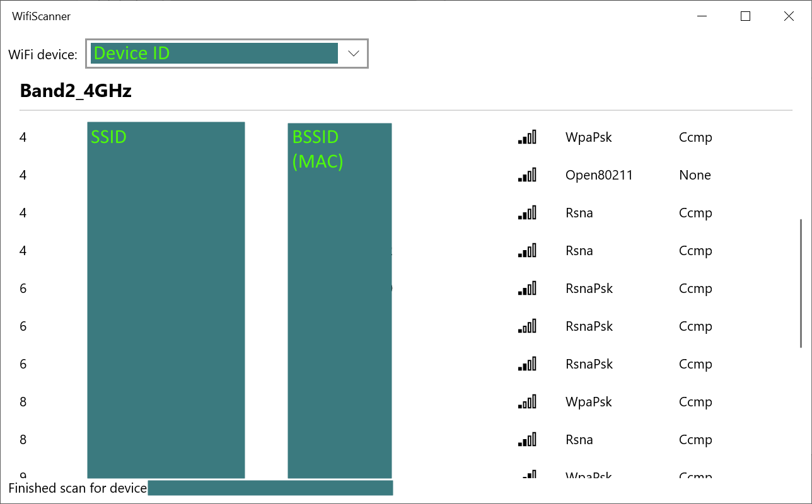

# WifiScanner

A simple UWP application showing the WiFi networks in range, with additional information about each available network.

The primary purpose is to list networks channels to check for overlaps, and be able to decide of a different channel (frequency band) to avoid interferences with neighbors, in an attempt to improve the connection quality. 

